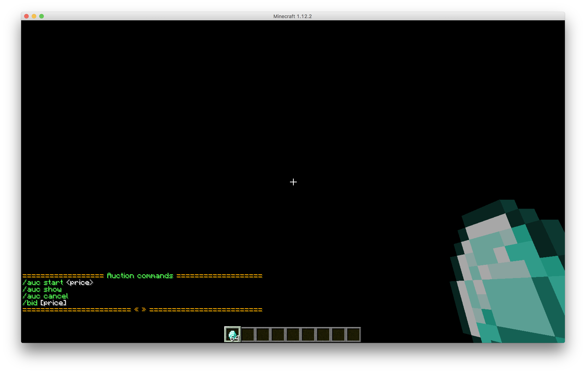
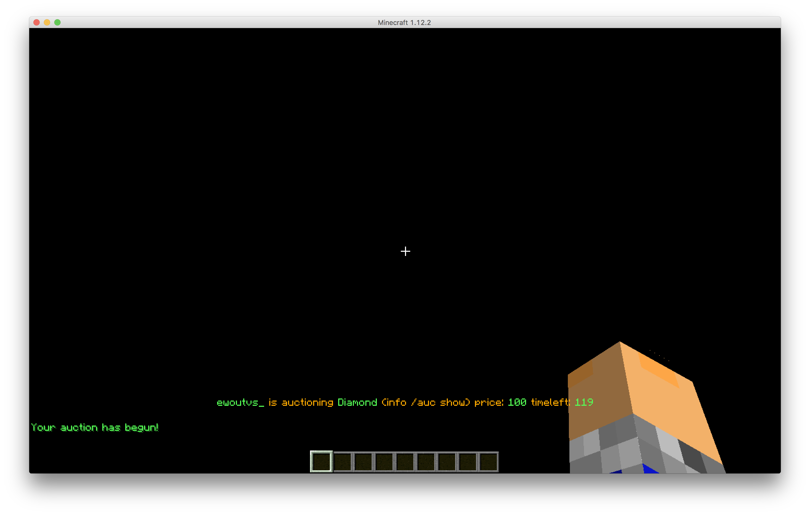
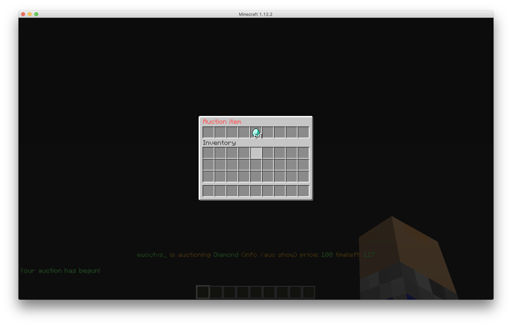

# Auction
Sponge Auction

This plugin is a global auction plugin that only allows 1 user to auction a item at a time.
It also does not spam the chat because everything happens in the ActionBar

## Commands

Use `/auc` or `/auction`

- `/auc start <price>` start a auction with the item in hand (permission: `auction.start`)
- `/auc cancel` cancel your auction (permission: `auction.cancel`)
- `/auc show` show in a inventory the current item (permission: `auction.show`)
- `/bid [price]` bid on a item if no price is supplied adds 100 to current bid (permission: `auction.bid`)

## Screenshots

 